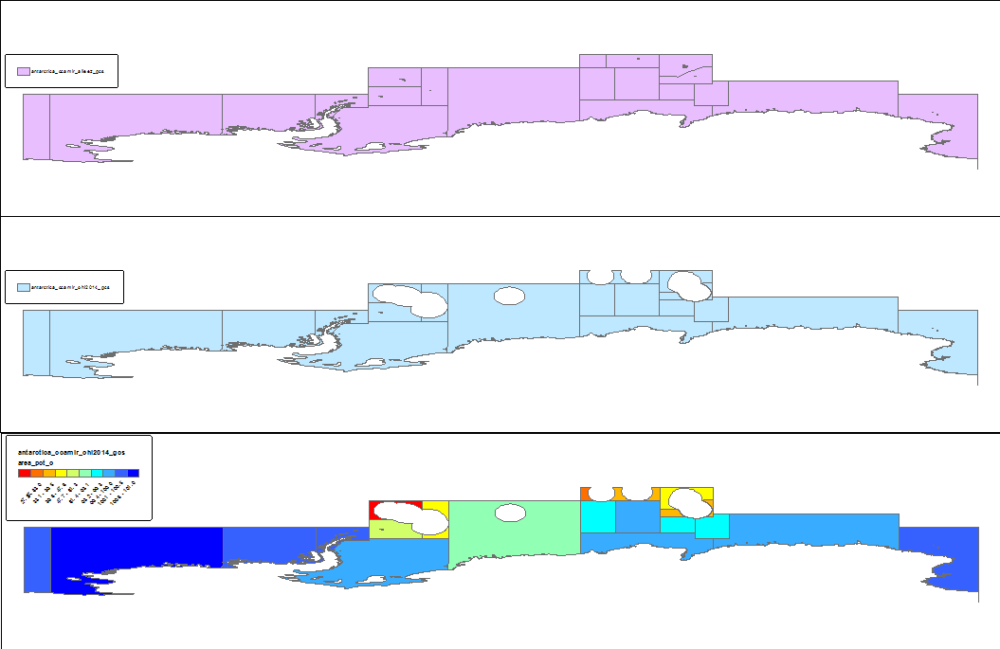

NCEAS-Regions_v2014
===================

## Description
The OHI 2014 regions cover the entire earth with non-overlapping regions having the following fields:
* **rgn_type**, having possible values (types to be filtered out of OHI analysis indicated by ~~strikethrough~~):
  - eez: exclusive economic zone (EEZ)
  - ~~eez-disputed~~: disputed EEZ
  - ~~eez-inland~~: inland EEZ of Caspian and Black Seas
  - fao: offshore Food & Agriculture Organization (FAO) Major Fishing Areas, with EEZs erased
  - land: terrestrial land having same name and id as the corresponding EEZ
  - ~~land-disputed~~: disputed land
  - ~~land-noeez~~: land without any corresponding EEZ (not including eez-inland)
* **rgn_id**: unique identifier (within same rgn_type)
* **rgn_name**: name for region

## References

- EEZ:
  + Claus, S.; De Hauwere, N.; Vanhoorne, B.; Deckers, P.; Souza Dias, F.; Hernandez, F.; Mees, J. (2014). **Marine Regions: Towards a global standard for georeferenced marine names and boundaries**. _Mar. Geod._

## Outputs

The two main outputs are in geographic coordinate system (gcs):
* **sp_gcs***: spatial areas  based on original EEZs v8 and Antarctica CCAMLR subregions. Version 8 of the EEZs introduced [changes](http://www.marineregions.org/files/eez_v8_changes.php) including splitting of EEZs (Guadeloupe and Martinique; Puerto Rico and Virgin Islands of the United States), which got merged back to form the same regions as OHI 2013.

* **rgn_gcs***: OHI regions dissolved on these fields in sp_gcs: rgn_type, rgn_id, rgn_name, rgn_key. Most significantly, the Antarctica CCAMLR regions become a single Antarctica EEZ, and several of the EEZs get merged into a single OHI region. The correspondence between sp and rgn is maintained by [manual_output/sp_rgn_manual.csv](https://github.com/OHI-Science/ohiprep/blob/master/Global/NCEAS-Regions_v2014/manual_output/sp_rgn_manual.csv).

The two formats (and locations) for the outputs are in:
* **\*.shp** in `\\neptune\git_annex\Global\NCEAS-Regions_v2014\data\`
* **\*_data.csv** in [`data/`](https://github.com/OHI-Science/ohiprep/tree/master/Global/NCEAS-Regions_v2014/data).


## Identifiers

The **_sp_rgns_.sp_id** is an integer translated from the original source ID like so:

  source | sp_id scheme | applicable sp_types
  ------:|:-------------|:-------------------
  **EEZ** | id | eez, eez-disputed, eez-inland, land, land-disputed
  **FAO** | 1,000 + FAO id (18, ..., 87) | fao
  **CCAMLR** | 200,000 + CCAMLR id (48.1, ...,  58.4.4.b, ..., 88.3) | eez-ccamlr, land-ccamlr

resulting in sample rows like:

  sp_id|sp_type|sp_name_orig|sp_name
  ----:|:------|:-----------|:------
  0|eez|Australia|Australia
  0|land|Australia|Australia
  74|eez-inland|Georgia|Georgia
  74|land-noeez|Georgia|Georgia
  165|eez-disputed|Colombia - Jamaica|Colombia - Jamaica
  165|land-disputed|Colombia - Jamaica|Colombia - Jamaica
  210|land|Japan|Japan
  211|eez-disputed|Japan - Korea|Japan - Korea
  260|eez-disputed|Trinidad and Tobago/Venezuela/Guyana|Trinidad and Tobago/Venezuela/Guyana
  301|land-noeez|Afghanistan|Afghanistan
  337|land-noeez|Zimbabwe|Zimbabwe
  1018|fao|18|Arctic Sea
  1021|fao|21|Atlantic, Northwest
  1047|fao|47|Atlantic, Southeast
  1087|fao|87|Pacific, Southeast
  248100|eez-ccamlr|48.1|CCAMLR 48.1
  258420|eez-ccamlr|58.4.2|CCAMLR 58.4.2
  258431|eez-ccamlr|58.4.3.a|CCAMLR 58.4.3.a
  258432|eez-ccamlr|58.4.3.b|CCAMLR 58.4.3.b
  288300|eez-ccamlr|88.3|CCAMLR 88.3

# TODO: check Ukraine (any EEZ? 57), Tuvalu (19)

## Inputs
* EEZ, EEZ_land (http://marineregions.org)
* FAO: Food & Agriculture Organization (FAO) Major Fishing Areas, including CCAMLR Antarctica regions (http://www.fao.org/fishery/area/search/en)
* Z: master lookup table to go from EEZ to OHI regions from 2013 regions

## Process
* remove Antarctica from EEZ
* erase EEZ_land from FAO
* dissolve CCAMLR regions in FAO to create Antarctica EEZ
* add 1000 to FAO ids to create FAO rgn_id
* erase EEZ from EEZ_land to get land
* replace some iso3 in land to match EEZ ('MNP++' to 'MNP', 'ABW' to 'AW', 'BES' to 'BQ')
* select out land parts either misidentified ('SHN' for eezs 'ASC', 'TAA') or iso3 is duplicated having several eez_ids
iso3 IN ('SHN','ATF','AUS','BRA','CHL','ECU','ESP','IND','KIR','PRT','TLS','UMI','USA','ZAF')
* associate these land parts with the neighboring EEZs
* create Antarctica land by erasing rest from earth box and dissolving every polygon with a centroid less than 60 degrees latitude
* go through slivers of FAO and holes from earth box erased by the rest and manually associate with legit region
* convert EEZ of Caspian and Black Seas to land
* merge all products and peform checks for overlap and geometry repair


## Antarctica

Note that the EEZ's have been clipped from the original CCAMLR regions as described in the FAO Major Fishing Areas. Here's the original non-overlapping CCAMLR regions for Antarctica and the OHI subset of regions with the EEZs clipped, as well as proportion of original.



Some of the regions slightly exceed 100% of the original region. This is presumably related to some strange ArcGIS geodesic area calculation differences, since slivers were not otherwise added to the OHI version.

Made an Antarctic specific set of shapefiles here:

    \\neptune\data_edit\git-annex\Global\NCEAS-Regions_v2014\data

* antarctica_ccamlr_alleez_gcs.shp: CCAMLR regions before being clipped by EEZs
  - area_orig_ -> area_orig_km2
  
## Buffers

Buffers were applied to all sp_gcs with valid regions (excluding sp_types: eez-inland, land-disputed and eez-disputed) that have both inland and offshore components. 

The following buffer zones have been applied (see [ohicore#40](https://github.com/OHI-Science/ohicore/issues/40 for latest):

* **offshore3nm**
* **offshore1km**
* **inland1km**
* **inland25km**
* **inland50km**

Each of the above buffers has the following outputs:
```
git-annex/Global/NCEAS-Regions_v2014/data/
    sp_[buffer]_gcs.shp
    rgn_[buffer]_gcs.shp
ohiprep/Global/NCEAS-Regions_v2014/data/
    sp_[buffer]_gcs_data.csv
    rgn_[buffer]_gcs_data.csv
```

The following offshore spatial regions do not have any buffers since they are without any land:

* 1018: Arctic Sea
* 1021: Atlantic, Northwest
* 1027: Atlantic, Northeast
* 1031: Atlantic, Western-Central
* 1034: Atlantic, Eastern Central
* 1041: Atlantic, Southwest
* 1047: Atlantic, Southeast
* 1051: Indian Ocean, Western
* 1057: Indian Ocean, Eastern
* 1061: Pacific, Northwest
* 1067: Pacific, Northeast
* 1071: Pacific, Western Central
* 1077: Pacific, Eastern Central
* 1081: Pacific, Southwest
* 1087: Pacific, Southeast
* 248300: CCAMLR 48.3
* 248400: CCAMLR 48.4
* 258431: CCAMLR 58.4.3.a
* 258432: CCAMLR 58.4.3.b
* 258441: CCAMLR 58.4.4.a
* 258442: CCAMLR 58.4.4.b
* 258510: CCAMLR 58.5.1
* 258520: CCAMLR 58.5.2
* 258600: CCAMLR 58.6
* 258700: CCAMLR 58.7
