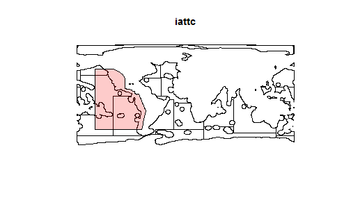
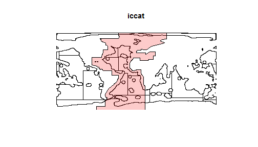
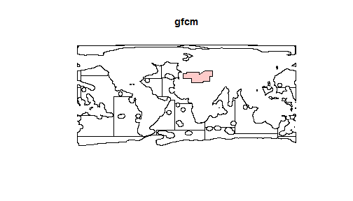
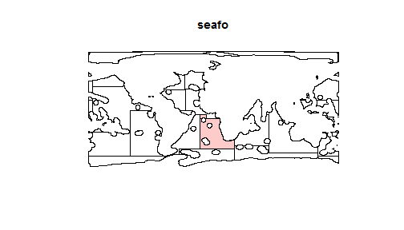

RFMO regions and the High Seas
========================================================
Here are some figures of the FAO regions and the RFMO regions (red areas). 

We are trying to determine the best way to convert the RFMO scores to regional values.  The complication is mainly when there are overlapping RFMOs.   

The darker red areas indicate overlapping RFMO regions:

 

Here they are individually:

              

When a region has only one RFMO or multiple non-overlapping RFMOs, it is easy to calculate resiliance by weighting the score by the area of the RFMO relative to the area of the FAO region.  

For example, if an RFMO has a score of 0.9 and covers 40% of the FAO region, the resilience score for the FAO region would be: 0.9*0.4=0.36.

The next simplest case is if a region is completely covered by multiple RFMO regions.  For example, if an FAO region is completely covered by two RFMOs, one with a score of 0.5 and the other 1.  Should the score of the region be 1.5 or 1 (I don't think 0.75, the remaining option, makes much sense)?

Then, the analysis becomes fairly complicated when FAO's overlap, but don't cover the entire FAO region......

Anyway, what do you think is the best bet here?
