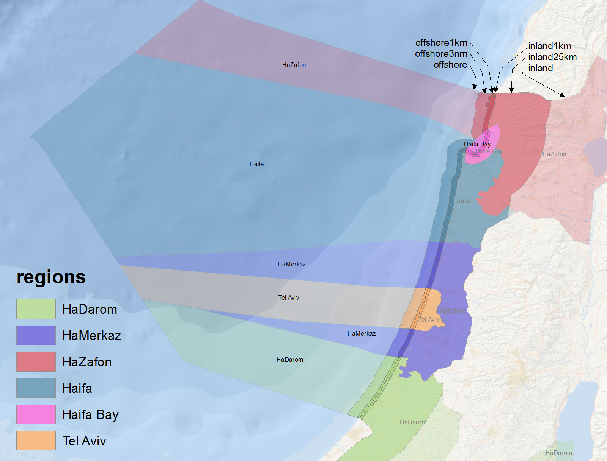

# Israel Hamaarag-Regions_v2014a

Regions were generated with inland and offshore buffers as shapefiles and csv data files that are used in the Ocean Health Index by [model.py](./model.py) in ArcGIS 10.2:
- offshore ([csv](./data/rgn_offshore_data.csv))
- offshore1km ([csv](./data/rgn_offshore1km_data.csv))
- offshore3nm ([csv](./data/rgn_offshore3nm_data.csv))
- inland ([csv](./data/rgn_inland_data.csv))
- inland1km ([csv](./data/rgn_inland1km_data.csv))
- inland25km ([csv](./data/rgn_inland25km_data.csv))

## Creation
- Used offshore and inland areas from MarineRegions for Israel
- Expanded GADM2 (of Israel and Palestine) with Voronoi diagrams into the entire area, inland and offshore
- Excluded Palestinian territories of Ghaza and West Bank (included by MarineRegions in it's description of Israel)
- Excluded the Red Sea
- Burned in Haifa Bay with a 5 km buffer inland

## Toolbox

The format compatible for visulation in the [Isreal OHI toolbox](https://github.com/bbest/ohi-israel) was also generated by [digest.R](./digest.R): data/regions.gcs.js.  This was based on a smoothed shapefile which is also handy for quickly generating maps in R.

