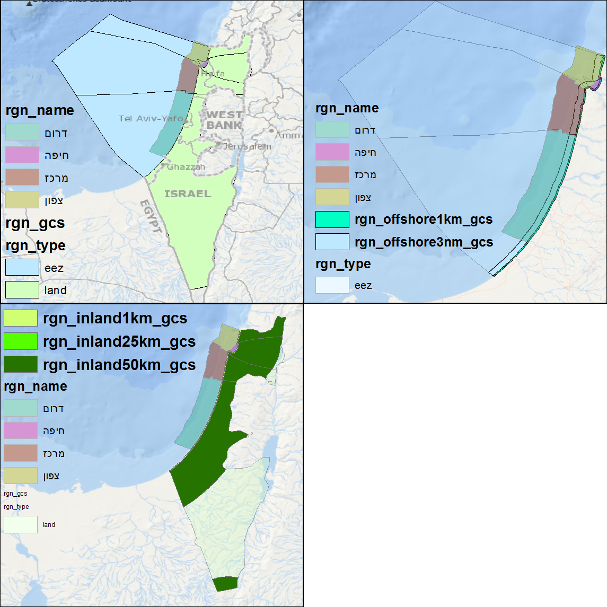

# Israel Hamaarag-Regions_v2014a

Regions were generated with inland and offshore buffers used in the Ocean Health Index by [model.py](./model.py) in ArcGIS 10.2:
- offshore1km
- offshore3nm
- inland1km
- inland25km
- inland50km

## Issues
- smaller study area? missing southern coast?
- inland50km lower right
- inland25km non-existent

## Toolbox

The format compatible for visulation in the [Isreal OHI toolbox](https://github.com/bbest/ohi-israel) was also generated by [digest.R](./digest.R): data/regions.gcs.js.

