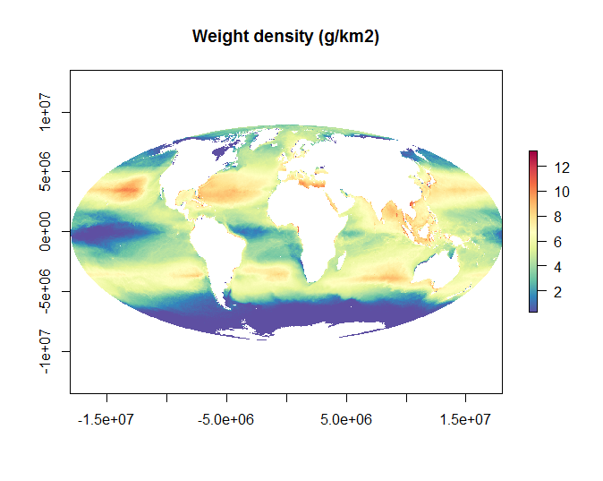

##Marine Plastics Layer for OHI 2015

This data was used in the 2015 OHI global analysis for the Clean Waters goal. 

If the data produced here is used in publication, please make attribution clear. For citation see the most current release [here](https://github.com/OHI-Science/ohiprep/releases)

### Data

The data used here comes from [Eriksen et al. (2014)](http://journals.plos.org/plosone/article?id=10.1371/journal.pone.0111913). Global count and weight data on four different size classes of plastic are provided.

**Native Data Resolution**:   
**Values**: Count (number/km2) and weight (g/km2) across 4 size classes  
**Time Range**: N/A
**Format**: GeoTIFF

### Scripts

### Updates from previous assessment

***

### Methods Overview

For OHI we used the weight density data:

The data was summed across all 4 size classes and log transformed:

The **reference point** was set at the 99.99th quantile of the data distribution to rescale the layer from 0 to 1.

**References**