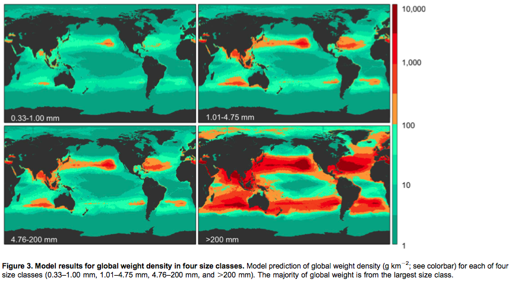
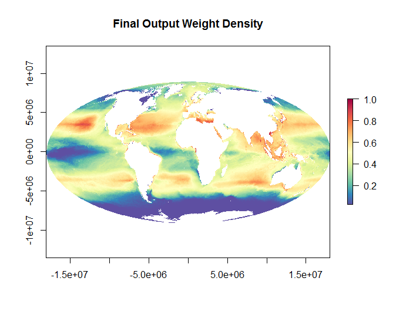

**Marine Plastics Layer for OHI 2015**

This data was used for the OHI Clean Waters goal

The data used here comes from [Eriksen et al. (2014)](http://journals.plos.org/plosone/article?id=10.1371/journal.pone.0111913). Global count and weight data on four different size classes of plastic are provided.

For OHI we used the weight density data:

The data was summed across all 4 size classes and log transformed:

The **reference point** was set at the 99.99th quantile of the data distribution to rescale the layer from 0 to 1.

