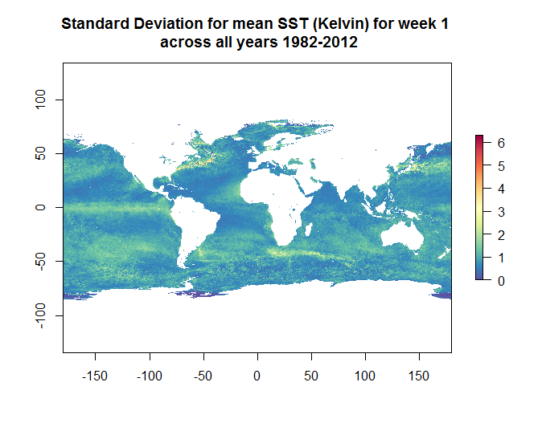
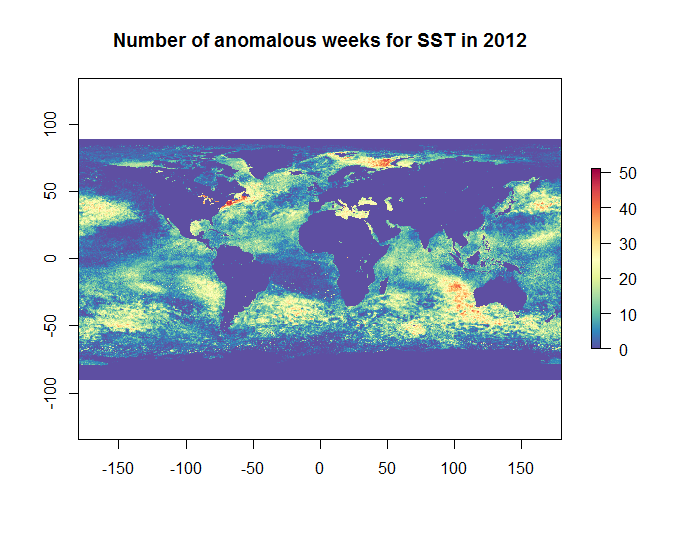
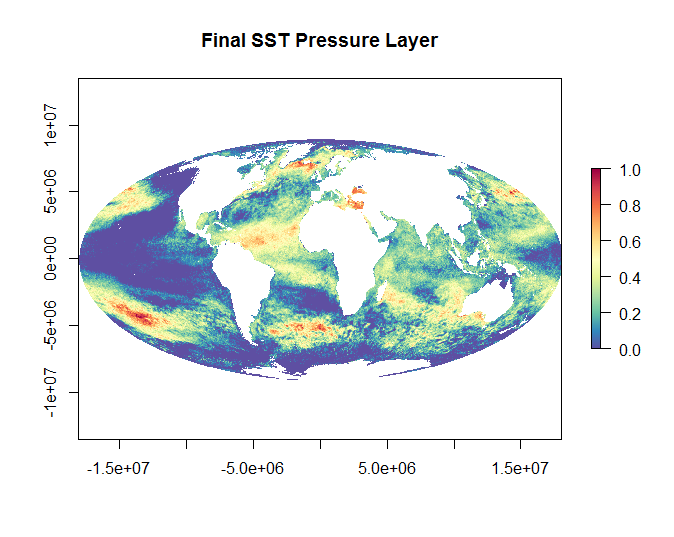

**Sea Surface Temperature for OHI 2015**
  
The SST data was updated using the same data source as previous assessments, but new years of data. [CoRTAD version 5](https://data.noaa.gov/dataset/the-coral-reef-temperature-anomaly-database-cortad-version-5-global-4-km-sea-surface-temperatub705f) now has data from 1982 through 2012. Previous assessments used SST anomaly data up to 2010.

Native resolution of the CoRTAD dataset is 4km
***

**Overview** (for full procedure see [sst_procedure.html]()):

For each week (1 to 53) across all years, the standard deviation of Weekly SST averages is calculated. As an example here is the standard deviation for week 1 across all years:

Then, for every year we are interested in knowing how many weeks are anomalous (defined as greater than the standard deviation). Negative anomalies are ignored.

Each week in a year is compared against the standard deviation for that week, and if the cell is greater, it is assigned a 1. This creates a single raster layer for each year from 1982 to 2012 that shows the number of anomalous weeks each cell has (from 0 to 53). Here is an example for 2012:

***

The SST pressure layer is created by looking at the change in these anomalies between the 5 most recent year (2008-2012)s, and 5 historical years (1985-1989). The years 1985-1989 were chosen to avoid the large El Nino event in 1982-1983.

This layer was rescaled from 0 to 1 using the 99.99th quantile as a reference point.

