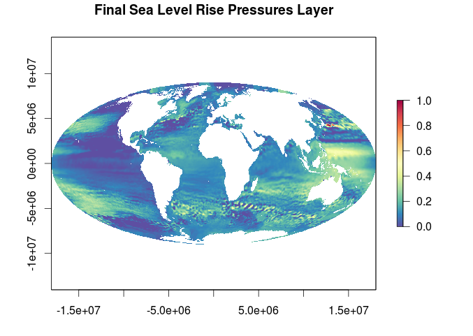

##Sea Level Rise Pressure Layer for OHI 2015 

If the data produced here is used in publication, please make attribution clear. For citation see the most current release [here](https://github.com/OHI-Science/ohiprep/releases)

###Data
  
Data for mean sea level rise (in mm) between January 1993 and June 2014 was downloaded on 1/12/15 from [AVISO](http://www.aviso.altimetry.fr/en/data/products/ocean-indicators-products/mean-sea-level/products-images.html). These raw products came as NetCDFs.

### Scripts

### Updates from previous assessment

This layer was updated with new data for years through 2014. Previous data went through 2012.  

***

### Methods Overview

The original sea level rise data (plotted above) was prepped for OHI 2015 as follows:

- All negative values, indicating decreases in sea level, were set to zero  
- Data was resampled from the native cell resolution (0.25 degrees) to ~ 1km
- The reference point was set as the 99.99th quantile of the data distribution to rescale all values from 0 to 1
- All NA cells were filled in through nearest neighbor interpolation

For full procedure and code see [slr_procedure.html](https://github.com/OHI-Science/ohiprep/blob/master/globalprep/AVISO-SeaLevelRise/v2015/slr_create_layer.html)

### Final Layer

