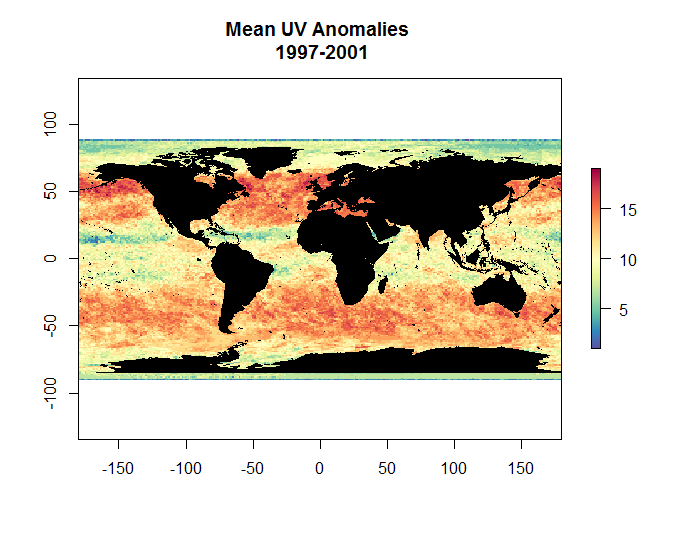
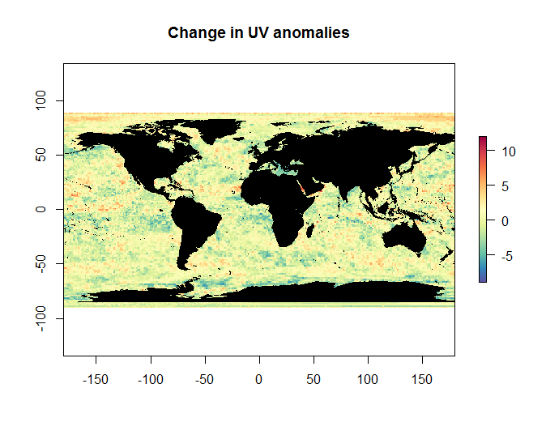

UV Pressures Layer

The Ultraviolet Radiation pressures layer uses the [Aura OMI GLobal Surface UVB Data Product](http://disc.sci.gsfc.nasa.gov/Aura/data-holdings/OMI/omuvbd_v003.shtml) which has a resolution of 1x1 degrees and *daily* data from 2004 to 2014.

Previous assessments used data up to 2012. For OHI 2015, data for 2013 and 2014 were included.

***

**Overview**

Daily data was used to create monthly averages of UVB irradiance for each year. These monthly rasters were then averaged for the 5 most recent years (2010-2014) and 5 historical years (1997-2001). 

The change in these two datasets is what is used as our pressure layer. Only increases in anomalies were included, all negative values were set to 0.

After all negative values were set to 0, the data was log transformed and the **reference point** was set at the 99.99th quantile. This is consistent with other pressure layers for OHI 2015. 

