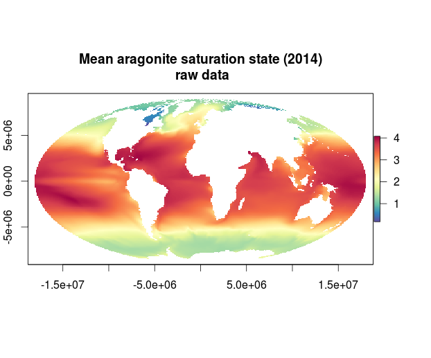
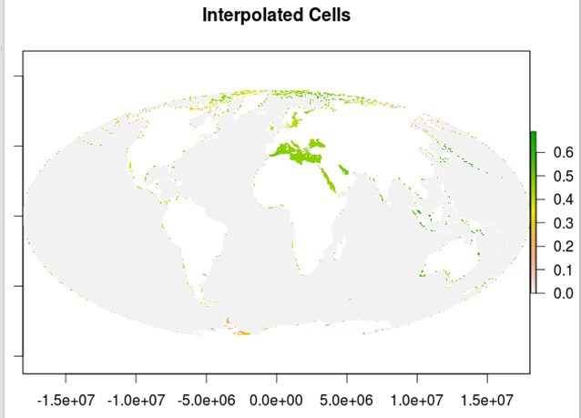

##Ocean Acidification Pressures Layer

Raw data provided  by Ivan Lima from Woods Hole. This data is an updated to the work done by Feely, Doney and Cooley and published in 2009.  

Monthly aragonite saturation state data provided for years 1880-1889 and 2005-2014 in NetCDF format with a resolution of about 1 degree.

**Procedure**

1. `oa_dataprep.r` turns NetCDF raw files into .tifs and has 2 functions:  
    1. calculates average annual aragonite saturation state for each year    
    2. calculates the average decadal saturation state    
    
  Example data
  
  
  
2. `create_global_oa_pressures_layer.R` does the following:  

    a. Takes each of the 10 raster layers produced in step 1, and subtract the historical global mean (produced in step 1) to create 10 new raster layers (one for each year) with values equal to the change in aragonite saturation state  
     b. All values that are 0 and below are set to 0  
     c. Finds the maximum value across all 10 raster layers produced in step a  
     d. Multiply this maximum value by 110% to get the reference point  
     e. Divide all raster layers by reference point  
     f. Interpolates values to the coast (for all 10 raster layers)  
     g. Resamples to 1km for the final output raster layer (for all 10 raster layers)    
     

    #####NOTE: reference point is 0.9259247 x 1.1 = 1.0185
    
3. `interpolated_cells.R` creates a raster of all interpolated cells for gapfilling purposes. The raw data comes on an irregular, curvilinear grid and therefore needs to have some interpolation. The Nearest Neighbor method was used. Interpolated cells:

  

Raster data located here: `N:\git-annex\globalprep\Pressures_acid\v2015\working\annual_oa_1km`  
 
 

Cite as: Woods Hole Oceanographic Institution. 2014 update to data originally published in: Feely, R.A., S.C. Doney, and
S.R. Cooley. 2009. Ocean acidification: Present conditions and future changes in a high-CO2 world.
Oceanography 22(4):36–47
