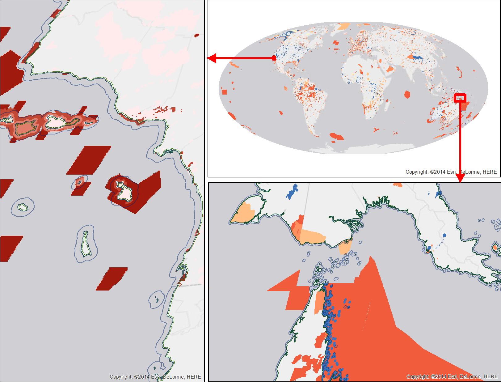

GL-WDPA-MPA_v2014
====

## Files produced
- [lsp_protarea_inland1km.csv](data/lsp_protarea_inland1km.csv)
- [lsp_protarea_offshore3nm.csv](data/lsp_protarea_offshore3nm.csv)

## Scripts

1. **model.py** 

    + selects the STATUS=Designated from the raw WDPA polygons, creates an ordering to prefer year based on:

       1. DESIG_TYPE: Regional > National > International
       1. STATUS_YR: early > later
  
    + converts the WDPA polygons to raster, assigning STATUS_YR to cell value, using inland1km and offshore3nm as a mask
    + tabulates area of regions by year established (STATUS_YR)
    
1. **digest.R** consumes the dbf table and writes out csv files with fields: rgn_id, year, area_km2

## Methods 2014

### #.#. Marine and terrestrial protected areas

**Update**: additional year and regional type available

**Description**: Data on protected areas were accessed from the United Nations Environment Programme - World Conservation Monitoring Centre’s World Database on Protected Areas (WDPA) through http://www.protectedplanet.net on March 28, 2014. We used only WDPA polygons (not points) with a status of “designated” (not “proposed”). These polygons were converted to a 1km Mollweide raster by the value of the year in which the park was decreed “designated”. For cases in which polygons overlapped, priority was given first to the parks with a designation type of the finest resolution (regional over national over international) and then by earliest year. In the future, we hope to apply buffers to parks spatially assigned as points based on area with extra logic to portion out the parks based on percentage marine vs terrestrial and limited to within country borders where applicable (Visconti et al. 2013). Spatial subsets used within the Lasting Special Places subgoal include the offshore 3 nm and inland 1km. The most recent full year was used for LSP status to be inclusive as possible, but presume a 3-year lag in exhaustive reporting to better estimate a trend.

## Figure



## Methods 2013

### 5.40. Marine protected areas and terrestrial protected areas

**Update**: additional year(s) available

**Description**: Data on protected areas through August, 2013 were accessed from the United Nations Environment Programme - World Conservation Monitoring Centre’s World Database on Protected Areas (WDPA) through http://www.protectedplanet.net. We used only WDPA polygons (not points) with a status of “designated” (not “proposed”). These polygons were converted to a 1km Mollweide raster by the value of the year in which the park was decreed “designated”. For cases in which polygons overlapped, priority was given first to the parks with a designation type of national (over international) and then the earliest year. In the future, we hope to apply buffers to parks spatially assigned as points based on area with extra logic to portion out the parks based on percentage marine vs terrestrial and limited to within country borders where applicable (Visconti et al. 2013). Spatial subsets used within the Lasting Special Places subgoal include the offshore 3 nm and inland 1km. The most recent full year was used for LSP status to be inclusive as possible, but presume a 3-year lag in exhaustive reporting to better estimate a trend.


## History

### September 23, 2013 (JStewart):

Final file in model/GL-WDPA-MPA_v2013 used in OHI 2013a and 2012a:
+  lsp_prot_area_offshore3nmb.csv

These files differ from the original files in the same folder in 1 way:
+  lsp_prot_area_offshore3nm.csv

* 1) values identified as having LSP scores of NA in a previous version of the results were found to be absent from lsp_prot_area_offshore3nm.csv and therefore were NA's (which show up as blanks). SO these rgns were added, with 0's, to the dataset (year was chosen to represent recent year):

  + 1      2009    0
	+ 8      2009    0
	+ 9      2009    0
	+ 10     2009    0
	+ 11     2009    0
	+ 30     2009    0
	+ 33     2009    0
	+ 34     2009    0
	+ 35     2009    0
	+ 36     2009    0
	+ 39     2009    0
	+ 45     2009    0
	+ 47     2009    0
	+ 52     2009    0
	+ 56     2009    0
	+ 67     2009    0
	+ 77     2009    0
	+ 85     2009    0
	+ 88     2009    0
	+ 95     2009    0
	+ 97     2009    0
	+ 98     2009    0
	+ 99     2009    0
	+ 103    2009    0
	+ 105    2009    0
	+ 107    2009    0
	+ 118    2009    0
	+ 119    2009    0
	+ 121    2009    0
	+ 125    2009    0
	+ 127    2009    0
	+ 141    2009    0
	+ 144    2009    0
	+ 146    2009    0
	+ 147    2009    0
	+ 148    2009    0
	+ 154    2009    0
	+ 156    2009    0
	+ 161    2009    0
	+ 186    2009    0
	+ 212    2009    0
	+ 215    2009    0
	+ 228    2009    0
	+ 249    2009    0
	+ 250    2009    0


# note! This should probably be done for the other input file ID'd in layers_navigation to be super tidy: model/GL-WDPA-MPA_v2013/data/lsp_prot_area_inland1km.csv, but it works appropriately this way.


Documentation of flags settings for run: BB's layers_2013.r /Volumes/local_edit/src/toolbox/code/layers_2013.R
-------------------------------------------------

###  flags for running
```r
get.googledoc=T; gen.nav=T; check.nav=T; open.nav=F; assemble.nav=T
#get.googledoc=T; gen.nav=T; check.nav=T; open.nav=T; assemble.nav=T
do.pressures=F; do.resilience=F
#do.pressures=T; do.resilience=T
do.ICO=F; do.CS=F; do.CP=F; do.HAB=F; do.AO=F; do.LSP=T; do.FIS=F; do.MAR=F; do.SPP=F; do.TR=F; do.CW=F; do.NP=F; do.LIV.ECO=F
#do.ICO=T; do.CS=T; do.CP=T; do.HAB=T; do.AO=T; do.LSP=T; do.FIS=T; do.MAR=T; do.SPP=T; do.TR=T; do.CW=T; do.NP=T; do.LIV.ECO=T
do.summary=T
do.maps = F; do.asters=T
```

### RESULTS found on Neptune: 
* Results files: local_edit/src/toolbox/scenarios/global_2013a/results/
* Aster Flower plots: local_edit/src/toolbox/scenarios/global_2013a/results/fig/flowers/


* to run with do.maps = T:
	+  install.packages('maptools')
	+  install.packages('sp')
	+  install.packages('rgdal')
