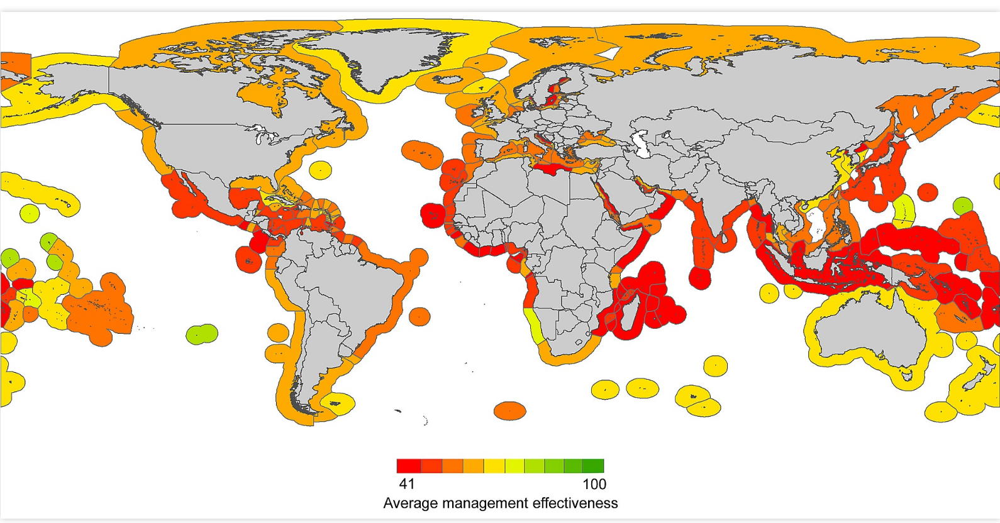

# README

**Mora et al. 2009. Management Effectiveness of the World's Marine Fisheries. PLOS Biology.** [http://dx.doi.org/10.1371/journal.pbio.1000131](http://journals.plos.org/plosbiology/article?id=10.1371/journal.pbio.1000131)

Data from Mora et al. 2009 are used for global Ocean Health Index assessments as two resilience measures. 

### 1. fisheries management effectiveness

Data from from Mora et al. 2009, 

Description from Halpern et al. 2012, Supplemental Information, p. 41.

"These data come from Mora et al. [2009], and assess the current effectiveness of fisheries management regimes along 6 axes: Scientific Robustness, Policy Transparency, Implementation Capacity, Subsidies, Fishing Effort, and Foreign Fishing. All countries with coastal areas were assessed through a combination of surveys, empirical data and enquiries to fisheries experts. For each OHI reporting region, scores for each category were rescaled between 0 and 1 using the maximum possible value for each category and then the average score of all 6 categories combined was recorded as the overall Fisheries management effectiveness score."

### 2. artisanal and recreational fisheries 

Data from from Mora et al. 2009 supplementary figure S4.

Description from Halpern et al. 2012, Supplemental Information, p. 19

"To assess the opportunity or ability to meet this demand, we used data from Mora et al. [2009], which scores countries on the institutional measures that support or facilitate artisanal and small-scale fishing. The data come from Figure S4 in Mora et al. [2009; see screenshot below], which is based on two survey questions focused on recreational and artisanal fishing (see Table S5 below for questions) and are on a scale from 0 to 100 (which we then rescale 0-1), where higher scores indicate better management. We extracted the data from the color codes on the map in Figure S4. There may be some small errors far a few countries due to difficulty of distinguishing between the two red colors at the lowest end of the scale."

**Mora et al 2009, figS4.**

**Table S5. Questions from Mora et al. [2009] that were used to evaluate access to artisanal scale fishing.**
 
If recreational fishing exists to any extent, which of the following apply:

- Are recreational fishermen required to have a fishing license? Y/N
- Are there regulations to the size of fish caught? Y/N
- Are there regulations to the number of fish caught? Y/N
- Are there regulations to the number of fishermen allowed to fish? Y/N
- Are there statistics being collected for this sort of fishing? Y/N

If artisanal fishing exists to any extent, which of the following apply?
- Are there regulations to the size of fish caught? Y/N
- Are there regulations to the number of fish caught? Y/N
- Are there regulations to the number of fishermen allowed to fish? Y/N
- Are there statistics being collected for this sort of fishing? Y/N