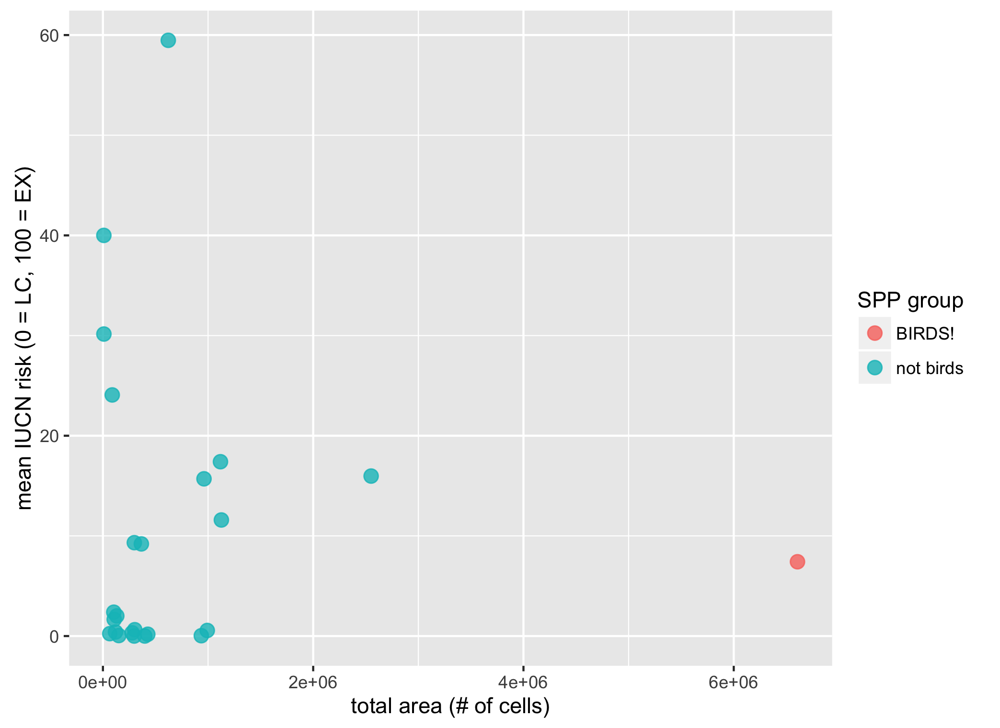

```{r setup, echo = FALSE, message = FALSE, warning = FALSE}

knitr::opts_chunk$set(fig.width = 6, fig.height = 4, fig.path = 'Figs/',
                      echo = FALSE, message = FALSE, warning = FALSE)

library(readr)

source('~/github/ohiprep/src/R/common.R')

goal     <- 'globalprep/spp_ico'
scenario <- 'v2016'
dir_goal_anx   <- file.path(dir_M, 'git-annex', goal, scenario) 
dir_data_am    <- file.path(dir_M, 'git-annex/globalprep/_raw_data', 'aquamaps', 'd2015') 
dir_data_iucn  <- file.path(dir_M, 'git-annex/globalprep/_raw_data', 'iucn_spp', 'd2015') 
dir_data_bird  <- file.path(dir_M, 'git-annex/globalprep/_raw_data', 'birdlife_intl', 'd2015') 
dir_goal  <- file.path('~/github/ohiprep', goal, scenario)

### set up provenance tracking for this script:
# source(file.path('~/github/ohibc', 'src/R/prov.R'))          


source(file.path(dir_goal, 'spp_fxn.R'))
if(!file.exists(file.path(dir_goal, '../README.md'))) {
  warning(sprintf('No README detected in %s', normalizePath(file.path(dir_goal, '../'))))
}
if(!file.exists(file.path(dir_goal, 'README.md'))) {
  warning(sprintf('No README detected in %s', file.path(dir_git, scenario)))
}
# SPP-specific and ICO-specific functions
```

<!--[REFERENCE RMD FILE: https://rawgit.com/OHI-Science/ohiprep/master/globalprep/Pressures_OceanAcidification/v2015/oa_create_layer_2015.html]-->

# Summary

Spatial data from IUCN and Aquamaps is combined with extinction risk information from IUCN to generate regional scores for the Species subgoal.  A region's status is based upon an area-weighted average of species health across each global reporting region.

From Halpern et al (2012):

> The target for the Species sub-goal is to have all species at a risk status of Least Concern. We scaled the lower end of the biodiversity goal to be 0 when 75% species are extinct, a level comparable to the five documented mass extinctions and would constitute a catastrophic loss of biodiversity. The Status of assessed species was calculated as the area- and threat status-weighted average of the number of threatened species within each 0.5 degree grid cell.

**Mean risk status per cell:**

$$\bar{R}_{cell} = \frac{\displaystyle\sum_{species}(Risk)}{n_{spp}}$$

**Mean risk status per region:**

$$\bar{R}_{SPP} = \frac{\displaystyle\sum_{cells}(\bar{R}_{cell} * A_{cell} * pA_{cell-rgn})}{A_{rgn}}$$

**Species goal model**

$$X_{SPP} = \frac{((1 - \bar{R}_{SPP}) - 0.25)}{(1 - 0.25)} * 100%$$

where:

* $X_{SPP}$ is Species goal status
* $\bar{R}_{cell}$ is mean extinction risk for one cell
* $\bar{R}_{SPP}$ is area-weighted mean extinction risk for a region
* $A_{cell}$ is cell area
* $pA_{cell-rgn}$ is percent of cell area included in region
* *Risk* is scaled value for species extinction risk category, based on: 
    * 'LC' = 0.0, 'NT' = 0.2, 'VU' = 0.4, 'EN' = 0.6, 'CR' = 0.8, 'EX' = 1.0
* SPP trend is calculated in a similar area-weighted mean, but population trend values are assigned according to:
    * 'Decreasing' = -0.5, 'Stable' = 0.0, 'Increasing' = +0.5

# Updates from previous assessment

Changes since 2015 SPP subgoal for global OHI:

* The 2016 assessment now includes bird species, based upon BirdLife International data.  "Marine" bird species include any bird species whose habitat, as listed by IUCN, includes "marine".  Prior assessments did not include this data.
* Previous assessments counted overlapping species as any species with a binomial included in both data sets (AquaMaps and IUCN).  Synonyms were matched and typos were fixed manually where possible.  This assessment takes advantage of the `taxize` package to identify and match synonyms for better confidence in matching species.
* Prior assessments, using older IUCN spatial data, relied on name matching to match IUCN information (incl. extinction risk category and population trend) to spatial information in IUCN shapefiles, which could generate duplicates or misse.  Newer IUCN spatial files (as of Dec 2015) include a unique IUCN species ID number field to unambiguously match species information to species ranges.
* Previous assessments used an AquaMaps threshold of 40% to determine whether a species counted as "present" within a cell.  Based on the IUCN/AquaMaps manuscript, we are now using a 0% threshold for AquaMaps as it more closely resembles the "limits of distribution" criterion used for IUCN inclusion.
* Previous assessments ignored subpopulations for SPP; with IUCN's newest data, a subpopulation field identifies distinct subpopulations (and IUCN risk codes) for a number of species (mostly mammals, but a handful of others as well).  This allows us to incorporate subpopulation scores in the global assessment.
    * From http://www.iucnredlist.org/details/3897/0 (Loggerhead sea turtle):
        * Rationale: The global population of the Loggerhead Turtle (Caretta caretta) comprises 10 subpopulations (see Figure 2 in the Supplementary Material) that vary widely in population size, geographic range, and population trends, and are the appropriate units for assessment of global conservation status for this species (Wallace et al. 2010, 2011). As such, assessments have been completed for each of the 10 subpopulations, in addition to the combined global population assessment required by the IUCN (see Table 1 in the Supplementary Material). At the global level, both geographic distribution and population size are much larger than required to qualify for a threatened category. The available long-term series of nest counts (used as an index of population abundance) show an important decrease in the past (47%). Therefore, the Loggerhead Turtle is considered as Vulnerable under current IUCN Red List Criteria (criterion A2b). The previous listing, published in 1996, was Endangered under criterion A1bd (Marine Turtle Specialist Group 1996).
        * __Results indicate that the Loggerhead Turtle, as a single taxonomic entity, will not go extinct globally in the next generation according to any Red List criteria. However, the global listing is not an appropriate representation of the conservation status__ of the biologically relevant subpopulations that make up the global Loggerhead Turtle population. Subpopulation assessments demonstrated wide variation not only in status of individual subpopulations (as indicated by IUCN Red List Categories), but also in the criteria under which the individual subpopulations qualified for a threatened category (see Table 1 in the Supplementary Material). For these reasons, the __subpopulation-level assessments for the Loggerhead Turtle should be given priority in evaluating the true global conservation status__ of this species. __This conclusion follows the precedent for other long-lived, widely distributed species,__ including the Leatherback Turtle (Wallace et al. 2013).

***

# Data Sources

IUCN:

* __Reference__: 
    * IUCN 2015. The IUCN Red List of Threatened Species. Version 2015-4. <http://www.iucnredlist.org>.
        * Shapefiles available from: http://www.iucnredlist.org/technical-documents/spatial-data
        * __Downloaded__: 21 December 2015.
    * BirdLife International and NatureServe (2015) Bird species distribution maps of the world. BirdLife International, Cambridge, UK and NatureServe, Arlington, USA.
        * Zipped shapefile available from: http://www.biodiversityinfo.org/spcdownload/r5h8a1/ - username and password via BirdLife International.  
        * __Downloaded__: 14 December 2015.
* __Description__:  Shapefiles containing polygons of assessed species ranges; each shapefile represents all assessed species within a comprehensively-assessed (i.e. >90% assessed) taxonomic group.
* __Native data resolution__: NA
* __Time range__: NA
* __Format__:  Shapefile

AquaMaps:

* __Reference__: 
    * Kaschner, K., J. Rius-Barile, K. Kesner-Reyes, C.Garilao, S.O. Kullander, T. Rees and R. Froese (2013). AquaMaps: Predicted range maps for aquatic species. World wide web electronic publication, www.aquamaps.org, Version 08/2015.
        * __Downloaded__: August 2015.
* __Description__:  .sql files containing information to recreate rasters of cell attributes and cell-by-cell probability of occurrence for 22889 marine species.
* __Native data resolution__: 0.5° latitude and longitude  
* __Time range__: NA
* __Format__:  SQL database files converted into .csv

***
  
# Methods

## Extract AquaMaps data from .sql files

AquaMaps data for the 2016 assessment was provided as .sql files, as in previous years, that can be used to generate an SQL database.  Each line in the .sql is a command to populate the SQL database.

* Original files extracted from `aquamaps_2015_full_dataset_ohi.zip`:
    * `hcaf_ohi.sql`
    * `speciesoccursum_ohi.sql`
    * `hcaf_species_native_ohi.sql`
* Processed files saved to git-annex:
    * `hcaf_truncated.csv`
    * `speciesoccursum.csv`
    * `hcaf_sp_native_trunc.csv`

To extract data, we instead scan each line for `CREATE TABLE` and `INSERT INTO` commands to create and save dataframes.  Note that the `am_extract_2015.R` script discards much of the data from these .sqls that is not used within the OHI Species Goal processing (thus "truncated").  This speeds up read time and processing time and avoids parsing issues with some of the rows/columns.
Note also that the hcaf_species_native_ohi.sql file does not originally contain LOICZID information; this is added in the extract script, since LOICZID as a cell identifier is faster and less memory intensive than CsquareCode (integer vs character string).

The `spp_ico/R/am_extract_2015.R` script performs these operations.  This can be a time consuming process, so typically this code chunk is run once and then set to `eval = FALSE` once the outputs have been generated.

``` {r Ingest Aquamaps data to csv from sql, eval = FALSE, echo = TRUE}

reload <- FALSE

source(file.path(dir_git, 'R/am_extract_2015.R'))

```

`r knitr::kable(read_csv(file.path(dir_data_am, 'csv/hcaf_truncated.csv'), n_max = 5), caption = 'Half-degree cell info from hcaf_truncated.csv (first few rows)')`

`r knitr::kable(read_csv(file.path(dir_data_am, 'csv/speciesoccursum.csv'), n_max = 5), caption = 'Species info from speciesoccursum.csv (first few rows)')`

`r knitr::kable(read_csv(file.path(dir_data_am, 'csv/hcaf_sp_native_trunc.csv'), n_max = 5), caption = 'Species-to-cell lookup from hcaf_sp_native_trunc.csv (first few rows)')`

## Ingest IUCN species list

To identify appropriate IUCN species for the analysis, we identified all IUCN Red List species whose habitat included "marine" designation.  The `ingest_iucn.R` script scrapes this data directly from the IUCN Red List website.

* Starting point: Access Red List API at http://api.iucnredlist.org/index/all.csv.  This provides a list of all Red List species, including unique IUCN code, taxonomic nomenclature, and Red List extinction risk.
* For all identified species, we access species-specific info at http://api.iucnredlist.org/details/X/0 where X is the unique IUCN species ID; this page is saved to a cache directory on git-annex as a .htm file.  At the same time, we scrape the "habitats" field from the saved page using XML tags.
* All species with "marine" habitat are then scraped to find details on population trend and subpopulation ID numbers.
* After some cleaning of scientific names (accents, spaces, html tags, etc) the file is saved to git-annex for later use.

Processed files, saved to `git-annex/globalprep/spp_ico/v201x/int`: 
* `spp_iucn_all.csv` - full list of IUCN species pulled from web, some cleaning.
* `spp_iucn_habitats.csv` - list of IUCN species (by iucn_sid) and corresponding habitat.
* `spp_iucn_marine.csv` - prepped list: cleaned marine list with subpops and trends.

The `spp_ico/R/ingest_iucn.R` script performs these functions.  This can be a time consuming process, so typically this code chunk is run once and then set to `eval = FALSE` once the outputs have been generated.

``` {r Ingest IUCN species list, eval = FALSE, echo = TRUE}

reload <- FALSE

source(file.path(dir_git, 'R/ingest_iucn.R'))

```

`r knitr::kable(read_csv(file.path(dir_goal_anx, 'int/spp_iucn_marine.csv'), n_max = 5), caption = 'IUCN marine species list and info from spp_iucn_marine.csv (first few rows)')`
 
## Generate full species lookup table

Having processed AquaMaps and IUCN species raw data, we can now prepare a full combined list of all species to be included in the OHI SPP goal.  The function `create_spp_master_lookup()` creates the full lookup table:

* Load AquaMaps species info from `speciesoccursum.csv`
    * Verify `sciname` field; the `verify_scinames()` function uses `taxize::gnr_resolve()` to compare AM scinames to accepted names from Encyclopedia of Life and NCBI databases - this helps resolve differences in naming conventions and species aliases.
* Load IUCN species info from `spp_iucn_marine.csv`
    * Verify `sciname` field as above.
* Join the two species lists by verified scientific names as the best common identifier.
* Create an extinction risk category field for each row, using IUCN category, or failing that the category listed in AquaMaps; failing that, assign NA.

At this point, the list is all AquaMaps species and all marine-identified IUCN species.  Next, identify the source of spatial distribution data for each species, if available.

* From the downloaded IUCN shapefiles, determine which species have spatial data.
* Depending on preference and availability of spatial source (AquaMaps or IUCN), tag each row with a specific `spatial_source` ("am" or "iucn").
* Follow a similar process for IUCN species included in the BirdLife International geodatabase (tag as "iucn-bli").

Now having identified spatial source availability and preference for all species on the list:

* Clean out duplicated species
* Assign numeric values to population Red List category and population trend.
* Save result to `git-annex/globalprep/spp_ico/v2016/int/spp_all_raw.csv`
* Filter out subpop species rows (species with a non-NA `parent_sid`) that do not have a named subpopulation location (i.e. `iucn_subpop` field is NA, instead of the name of a subpopulation)
* Save final list to `git-annex/globalprep/spp_ico/v2016/int/spp_all_cleaned.csv`

The `spp_ico/v2016/prep_spp_list.R` script performs these functions.  This does not take all that long, but the saved output can be used instead instead of reloading the entire process.  Note the optional arguments `source_pref` and `fn_tag` that can be used to customize the run (passed to `create_spp_master_lookup()` from `spp_fxn.R`); `'iucn'` and `''` are standard defaults.

``` {r Generate spp lookup, echo = TRUE}

reload      <- FALSE
source_pref <- 'iucn'
fn_tag      <- ''

source(file.path(dir_goal, 'prep_spp_list.R'))

```

`r knitr::kable(read_csv(file.path(dir_goal_anx, 'int/spp_all_cleaned.csv'), n_max = 5), caption = 'Combined species list from spp_all_cleaned.csv (first few rows)')`

## Spatialize species information using AquaMaps and IUCN spatial data

### Extract IUCN polygons to half-degree cells

We extract IUCN polygon presence to the same half-degree cells as AquaMaps to simplify the analysis.
* The `spp_all` species list includes a field `spp_group` that identifies which shapefile contains the spatial information for a given species.
    * for each species group, specific species are identified by comparing `iucn_sid` from dataframe to `id_no` within the shapefile.
* Extract loiczid cell IDs for each species within each species group.  Save a .csv file for that group, with fields:
    * sciname | iucn_sid | presence | subpop | LOICZID | prop_area
    * presence codes: 1 extant; 2 prob extant (discontinued); 3 Possibly Extant; 4 Possibly Extinct; 5 Extinct (post 1500); 6 Presence Uncertain
* __NOTE:__ this takes a long time - multiple hours for some of the shape files.  
    * by passing a filtered data frame to the function, you can focus the process only on new or updated shapefiles
    * reload = FALSE allows the function to skip extraction on groups with files already present.  Set to TRUE if you need to extract an updated shapefile (or change the shapefile name, or delete the previous extraction...).

The function `extract_loiczid_per_spp()` performs these functions, and is contained in the `spp_ico/v2016/spp_fxn.R` script.  This can be a time consuming process, so typically this code chunk is run once and then set to `eval = FALSE` once the outputs have been generated.

``` {r Generate lookup IUCN species to LOICZID, eval = FALSE, echo = TRUE}

spp_all <- read_csv(file.path(dir_goal_anx, 'int/spp_all_cleaned.csv'))

### set up maps_list for all standard (non-bird) IUCN species...
maps_list_iucn <- spp_all %>%
  filter(str_detect(spatial_source, 'iucn') & !str_detect(spatial_source, 'bli')) %>%
  dplyr::select(sciname, iucn_sid, spp_group) %>%
  unique()

extract_loiczid_per_spp(maps_list_iucn,
                        shp_dir = file.path(dir_data_iucn, 'iucn_shp'), 
                        fn_tag = scenario, 
                        reload = FALSE)

### set up maps_list for all bird IUCN species...
maps_list_bli <- spp_all %>%
  filter(str_detect(spatial_source, 'bli')) %>%
  dplyr::select(sciname, iucn_sid, spp_group) %>%
  mutate(spp_group = 'BOTW') %>%
  unique()

extract_loiczid_per_spp(maps_list_bli,
                        shp_dir = dir_data_bird, 
                        fn_tag = scenario, 
                        reload = FALSE)

```

### Generate cell-by-cell summary of species

For each half-degree cell, tally up the number of species present and determine a mean species risk value and population trend value for the cell.  

* At this point, the species-cell lists are filtered to species with valid extinction risk categories - i.e. not DD and not NA.
* Since this averaging is done for each data set separately, we also track the species count per cell used to determine both the risk and the trend (separately, since many species with a risk value have no trend information, i.e. NA).  These counts are used to weight the values when the two are combined.
* Data-set specific idiosyncracies:
    * For AquaMaps, we apply a threshold to set the minimum probability of occurrence that determines species "presence."
    * For IUCN, no threshold is needed; but the shapefiles include a "presence" attribute in which a value of 5 indicates a region in which a subpopulation has become extinct.  We use this to manually reset local extinction risk and trend to EX and NA respectively.
    * Note that for IUCN, we determine the proportional area when extracting polygons; currently we just consider any presence to fill the cell (similar to assuming even a low AquaMaps probability to indicate presence within the entire cell).
    
The following code chunk executes the functions that perform these tasks.  Note the optional arguments `fn_tag` and `prob_filter` that can be changed to facilitate custom runs (including different `spp_all` species info lists, different AquaMaps thresholds, and different filename tags to uniquely identify the custom run)

``` {r SPP Generate species per cell tables for Aquamaps and IUCN, echo = TRUE}

spp_all <- read_csv(file.path(dir_goal_anx, 'int/spp_all_cleaned.csv'))

am_cells_spp_sum <- process_am_summary_per_cell(spp_all, fn_tag = '', prob_filter = 0, reload = FALSE) %>%
  read_csv(col_types = 'dddddc')
### NOTE: keyed data.table works way faster than the old inner_join or merge.
### loiczid | mean_cat_score | mean_trend_score | n_cat_species | n_trend_species
### AM does not include subspecies or subpops: every am_sid corresponds to exactly one sciname.

iucn_cells_spp_sum <- process_iucn_summary_per_cell(spp_all, fn_tag = '', reload = FALSE) %>%
  read_csv(col_types = 'dddddc')
### loiczid | mean_cat_score | mean_trend_score | n_cat_species | n_trend_species
### IUCN includes subpops - one sciname corresponds to multiple iucn_sid values.

sum_by_loiczid_file  <- process_means_per_cell(am_cells_spp_sum, iucn_cells_spp_sum, fn_tag = '')
### This returns location of dataframe with variables:
### loiczid | weighted_mean_cat | weighted_mean_trend | n_cat_spp | n_tr_spp

```

`r knitr::kable(head(am_cells_spp_sum), caption = 'AquaMaps cell summary (first few rows)')`

`r knitr::kable(head(iucn_cells_spp_sum), caption = 'IUCN cell summary (first few rows)')`

## Summarize status and trend by region

Finally we take the two cell-by-cell summaries and combine, using a species-count weighting to determine the mean category and trend per cell.  Cells are aggregated to regions, to calculate an area-weighted regional mean category, trend, and status.

These are then saved to status and trend layer outputs for global (shown in table) as well as 3 nautical mile, Antarctic, and High Seas regions.

The script `spp_ico/v2016/layer_prep_spp_global.R` performs these tasks.

``` {r  SPP Global Summarize mean category and trend per cell and per region, echo = TRUE}

source(file.path(dir_goal, 'layer_prep_spp_global.R'))

```

`r DT::datatable(sum_by_rgn, caption = 'Region summary: mean category, trend, and status')`

These analyses are repeated for additional scenarios: 3 nautical mile coastal buffer (for resilience calculations), High Seas, and Antarctic.

``` {r SPP 3nm, echo = TRUE}

source(file.path(dir_goal, 'layer_prep_spp_3nm.R'))

```

``` {R SPP HS and Antarctic, echo = TRUE}

source(file.path(dir_goal, 'layer_prep_spp_hs_aq.R'))

```

## Summarize status and trend by region, excluding BirdLife International data

``` {r SPP Generate species per cell tables for Aquamaps and IUCN without birds, echo = TRUE}

spp_all_nobirds <- read_csv(file.path(dir_goal_anx, 'int/spp_all_cleaned.csv')) %>%
  filter(!(spp_group == 'BOTW' & is.na(am_sid))) %>% ### remove any BOTW with no AquaMaps map
  mutate(spatial_source = ifelse(spp_group == 'BOTW', 'am', spatial_source))

am_cells_spp_sum_nobirds <- process_am_summary_per_cell(spp_all_nobirds, fn_tag = 'nobirds', prob_filter = 0, reload = FALSE) %>%
  read_csv(col_types = 'dddddc')
### NOTE: keyed data.table works way faster than the old inner_join or merge.
### loiczid | mean_cat_score | mean_trend_score | n_cat_species | n_trend_species
### AM does not include subspecies or subpops: every am_sid corresponds to exactly one sciname.

iucn_cells_spp_sum_nobirds <- process_iucn_summary_per_cell(spp_all_nobirds, fn_tag = 'nobirds', reload = FALSE) %>%
  read_csv(col_types = 'dddddc')
### loiczid | mean_cat_score | mean_trend_score | n_cat_species | n_trend_species
### IUCN includes subpops - one sciname corresponds to multiple iucn_sid values.

sum_by_loiczid_file_nobirds  <- process_means_per_cell(am_cells_spp_sum_nobirds, iucn_cells_spp_sum_nobirds, fn_tag = 'nobirds')
### This returns location of dataframe with variables:
### loiczid | weighted_mean_cat | weighted_mean_trend | n_cat_spp | n_tr_spp

```

``` {r  SPP Global Summarize mean category and trend per cell and per region without birds, echo = TRUE}

source(file.path(dir_goal, 'layer_prep_spp_global_nobirds.R'))

library(ggplot2)
nobirds_df <- read_csv(file.path(dir_goal, 'output/spp_status_global.csv')) %>% 
  rename(status = score) %>%
  left_join(read_csv(file.path(dir_goal, 'output/spp_status_global_nobirds.csv'))  %>%
              rename(status_nobirds = score),
            by = 'rgn_id') %>%
  left_join(read_csv(file.path(dir_git, 'v2015', 'data/spp_status_global.csv'))  %>%
              rename(status_2015 = score),
            by = 'rgn_id')
  
scatter_nobirds <- ggplot(nobirds_df, aes(x = status_nobirds, y = status)) +
  geom_point(alpha = .5) +
  geom_point(aes(x = status_nobirds, y = status_2015), color = 'blue', alpha = .5) +
  geom_abline(color = 'red') +
  scale_x_continuous(limits = c(.5, 1)) +
  scale_y_continuous(limits = c(.5, 1)) +
  labs(x = 'Status: v2016 excluding Bird Life data',
       y = 'Status: v2015(blue), v2016 all (black)',
       title = 'SPP Status: excluding birds')
ggsave(file.path(dir_goal, 'Figs/scatterplot_spp_status_global_excl_bli.png'),
       plot = scatter_nobirds)
  
```

`r DT::datatable(sum_by_rgn_nobirds, caption = 'Region summary sans BLI: mean category, trend, and status')`

-----

``` {r SPP swapping priority on AM and IUCN spatial source, eval = FALSE}

### for AquaMaps/IUCN paper, using OHI case study
scenario <- 'vAM_IUCN'

pref_flag_vec <- c('_IUCNpref', '_AMpref')
prob_filt_vec <-   c(0.40, 0)

for (pref_flag in pref_flag_vec) {   ### pref_flag  <- pref_flag_vec[1]
  for (prob_filt in prob_filt_vec) { ### prob_filt <- prob_filt_vec[1]
    message('Processing parameters: ', pref_flag, ', prob = ', prob_filt)
    spp_all <- create_spp_master_lookup(source_pref = ifelse(pref_flag == '_AMpref', 'am', 'iucn'), 
                                        fn_tag = pref_flag, 
                                        reload = TRUE)
    # only affected by am/iucn preference
    spp_all <- spp_all %>%
      dplyr::select(-iucn_subpop) %>% ### need to figure out how to use this info
      dplyr::select(-sciname) %>%     ### get rid of this to eliminate duped names
      filter(!is.na(spatial_source)) %>% 
      unique()
        
    am_cells_spp_sum <- process_am_summary_per_cell(fn_tag = sprintf('%s_prob%s', pref_flag, prob_filt), 
                                                    prob_filter = prob_filt, reload = TRUE)
    # affected by prob filter and preference flag
    
    iucn_cells_spp_sum <- process_iucn_summary_per_cell(fn_tag = sprintf('_pref%s', pref_flag), reload = TRUE)
    # affected by preference flag
    
    sum_by_loiczid <- get_means_per_cell(am_cells_spp_sum, iucn_cells_spp_sum, 
                                             fn_tag = sprintf('%s_%s', pref_flag, prob_filt))
    
    rgn_cell_lookup <- extract_cell_id_per_region(reload = FALSE)
    
    sum_by_rgn     <- get_means_per_rgn(sum_by_loiczid, rgn_cell_lookup, 
                                            rgn_note = sprintf('%s_%s', pref_flag, prob_filt))
    ### This returns dataframe with variables:
    ### sp_id | rgn_mean_cat | rgn_mean_trend | status
    
    ### Create final outputs:
    spp_status <- sum_by_rgn %>%
      dplyr::select(rgn_id, score = status)
    spp_trend <- sum_by_rgn %>%
      dplyr::select(rgn_id, score = rgn_mean_trend)
    write_csv(spp_status, 
              file.path(dir_goal, 
                        sprintf('output/spp_status_global%s_prob%s.csv', pref_flag, prob_filt)))
    write_csv(spp_trend,  
              file.path(dir_goal, 
                        sprintf('output/spp_trend_global%s_prob%s.csv', pref_flag, prob_filt)))
  }
}

```

## Determine species by region

The `calc_rgn_spp()` function takes in lookup tables of species by cell (for both IUCN and AM), a cell-to-region lookup, and a species info lookup.  From this it generates a list of which species occur in which regions, including basic species information.

``` {r species_by_region, echo = FALSE, eval = TRUE}

iucn_cells_spp <- read_csv(file.path(dir_goal_anx, 'int/iucn_cells_spp.csv'),
                           col_types = 'cddddc')
am_cells_spp   <- read_csv(file.path(dir_goal_anx, 'int/am_cells_spp_prob0.csv'))

ics_keyed     <- data.table(iucn_cells_spp, key = "loiczid") 
acs_keyed     <- data.table(am_cells_spp,   key = "loiczid") 

rgn_keyed     <- data.table(rgn_cell_lookup,     key = "loiczid")
rgn_keyed_3nm <- data.table(rgn_cell_lookup_3nm, key = "loiczid")
rgn_keyed_aq  <- data.table(rgn_cell_lookup_aq,  key = "loiczid")
rgn_keyed_hs  <- data.table(rgn_cell_lookup_hs,  key = "loiczid")

rgn_spp_gl  <- calc_rgn_spp(ics_keyed, acs_keyed, rgn_keyed,     spp_all)
rgn_spp_3nm <- calc_rgn_spp(ics_keyed, acs_keyed, rgn_keyed_3nm, spp_all)
rgn_spp_aq  <- calc_rgn_spp(ics_keyed, acs_keyed, rgn_keyed_aq,  spp_all)
rgn_spp_hs  <- calc_rgn_spp(ics_keyed, acs_keyed, rgn_keyed_hs,  spp_all)

write_csv(rgn_spp_gl,  file.path(dir_goal_anx, 'summary/rgn_spp_gl.csv'))
write_csv(rgn_spp_3nm, file.path(dir_goal_anx, 'summary/rgn_spp_3nm.csv'))
write_csv(rgn_spp_aq,  file.path(dir_goal_anx, 'summary/rgn_spp_aq.csv'))
write_csv(rgn_spp_hs,  file.path(dir_goal_anx, 'summary/rgn_spp_hs.csv'))
```

`r knitr::kable(head(rgn_spp_gl), caption = 'Species by region - first few rows')`

# Comparing scenarios and changes in data

``` {r plot_scores_vs_2015}
### commented out - uncomment to regenerate plots...
# source(file.path(dir_goal, 'score_plot_spp.R'))

```

The following plots compare the status scores generated for the 2015 assessment to those generated for 2016.  

* The first compares the released region status for 2015 to the proposed status for 2016.  This changes both the datasets and the methodology between the two axes.
    * 2015 scores used data from 2014 (d2014) for both AquaMaps and IUCN, and scripts from the v2015 scenario and from the v2016 scenario to see the impact of the updated methods.  See the second plot to better understand the differences between these two.
    * 2016 scores use data from 2015 (d2015) for both AquaMaps and IUCN, and scripts from the v2016 scenario.
    

    
* The second compares original status for 2015 (using d2014 data) to the updated status applied to d2014 data.  This keeps the data largely the same, and compares the changes due to the updated methodology.
    * For this plot, both methods (v2015 and v2016) use a 40% threshold on AquaMaps data.
    * IUCN species-cell lookup for d2014 was generated using v2015 scripts, which relied on the `sciname` field for joining.  I've added a step to add `iucn_sid` values according to `sciname`, to allow the species-cell lookup to work with the v2016 scripts.  Much of the variation in the plot may be due to differences in name-matching.


The third examines one possible reason for the large shift in scores between the 2015 scores (d2014 data) and 2016 scores (d2015 data): the addition of birds to the IUCN spatial information.  Bird species have a fairly low area-weighted mean risk category, but include a very large number of total cells of coverage.  This means these lower-risk species have a very large impact on the final score compared to other species groups.



Finally, this plot compares the 2016 scores as calculated with and without BirdLife International data.  AquaMaps bird species were left in.  Blue points compare 2015 scores (which did not include BirdLife International data) to the 2016 scores excluding BirdLife International data.


``` {r child = file.path('~/github/ohibc', 'src/templates/ohibc_prov_ftr.Rmd'), eval = FALSE}
```
