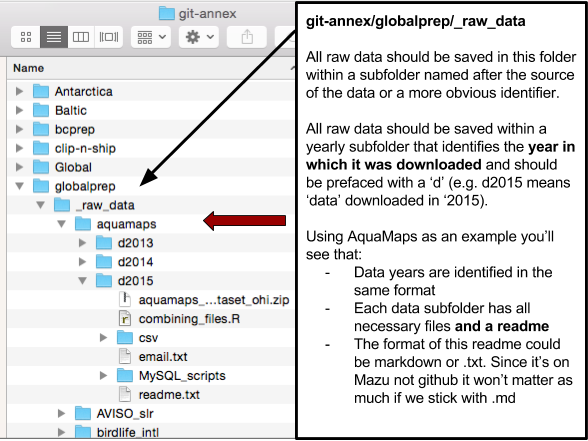
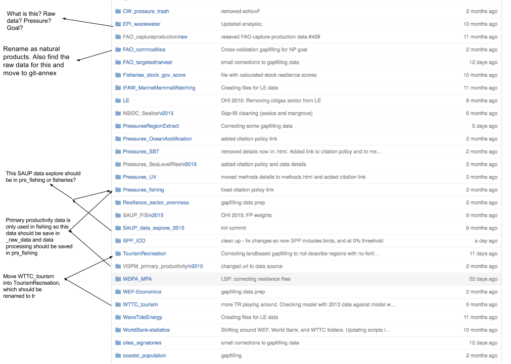
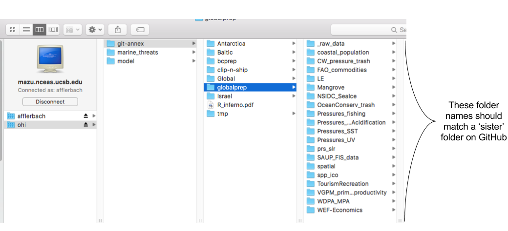
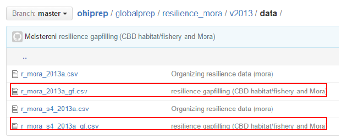
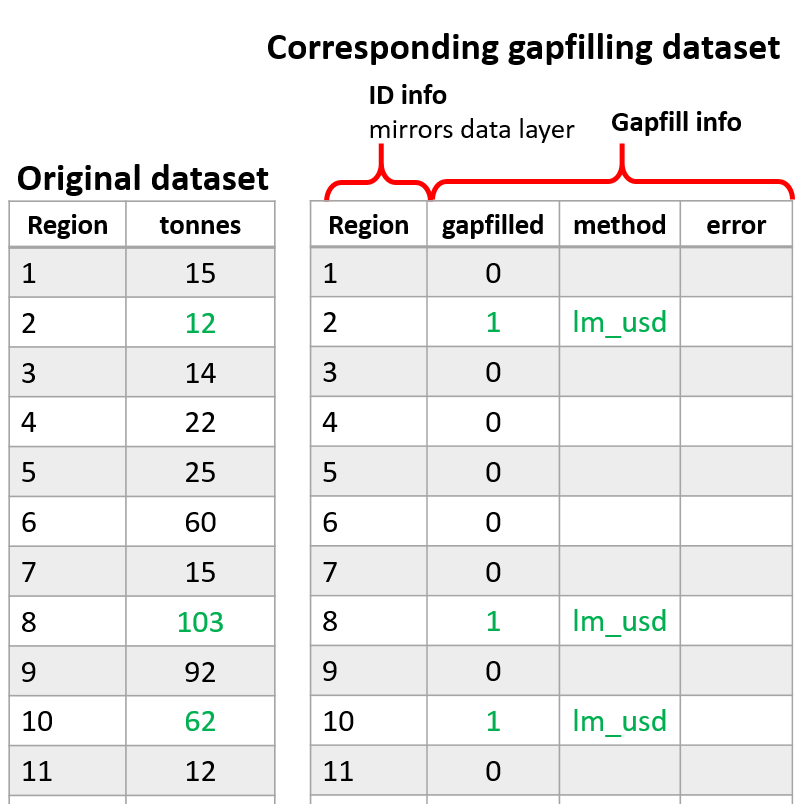

## SOP for data management for Ocean Health Index assessments

Each of us is responsible for organizing the data we prepare for OHI assessments. This document describes: 1) how to save data obtained from outside sources; 2) a description of how to organize data/scripts in Github; 3) how to deal with intermediate/working files that are too large for Github; and, 4) how to document the gapfilling of missing data.

### Saving data from outside sources

These data will be saved on NCEAS private server (Mazu).

Every raw data folder should have a README.md (keep the caps so it is consistent and easy to see). *Note we are using .md rather than .txt even for README on Mazu. 

Each README should include the following ([template](https://github.com/OHI-Science/ohiprep/blob/master/src/templates/generic_raw_data_README.md)):

* Detailed source information. For example:
    + full paper citation and link for publication
    + Link to online data source
    + Full email history with data provider 
* If it was downloaded online, provided written and visual instructions so that the reader can mimic your same steps to get the same data. Include screenshots if possible!
* Version information for data
* Years included in the datatset
* Year the data was published
* Type of data included in the dataset (e.g., catch per species (tons) per country)
* Any other information that could possibly be useful to anyone
  

***

### Organizing data/scripts on Github

All of the R scripts and metadata used to prepare the data, as well as the final data layers will be saved on Github (the globalprep folder for OHI global assessments) (https://github.com/OHI-Science/ohiprep/tree/master/globalprep).

The only data that will not be saved on Github are files that are too large or incompatible with Github (see below).

**Primary goal/component folder** The folder should be named according to the component not the data source. For example the folder for the tourism and recreation goal would be called: globalprep/tr (see table below). These recommendations should be modified as needed, for example goals can be combined in a single folder (e.g., spp_ico) or, there may be several folders for different components of a single goal (e.g. tr_sustainability and tr_tourists).

target      |   suggested folder name
----------- | ------------------
Artisanal Fishing Opportunity | ao
Carbon Storage | cs
Clean Waters | cw
Coastal Protection | cp
Coastal Livelihoods | liv
Coastal Economies |eco
Fisheries   | fis
Habitats | hab
Iconic Species | ico
Lasting Special Places | lsp
Mariculture | mar
Natural Products | np
Species    | spp
Tourism and Recreation | tr
Pressure | prs_*additional_pressure_id*
Resilience | res_*additional_resilience_id*

This folder will contain:

* a *README.md* that will link to the appropriate information pages on ohi-science.org  The README.md should follow this  [template](https://github.com/OHI-Science/ohiprep/blob/master/src/templates/generic_readme.md).
    
* **Year-specific folders** within the goal/component folder organize output by assessment year (v2015, v2016).  Each of the assessment year folders  should have:
      * a README.md (see [this template](https://github.com/OHI-Science/ohiprep/blob/master/src/templates/generic_readme_year.md)) 
      * a data_prep.R, or .Rmd that is well-documented. [Here is the dataprep template](https://github.com/OHI-Science/ohiprep/blob/master/src/templates/generic_data_prep.Rmd). 
      * a series of folders to organize data that include:
        + `raw` for 'raw-ish' type files that would not be on the server. This is more for piecemeal raw data gathered from many places than a single dataset downloaded or emailed to use.  In many cases, this folder will not be used.
        + `int` for intermediate files (previously we’ve used tmp, working, or other naming conventions).
        + `output` for the final data layer that is used in the OHI toolbox.

The final datasets (the ones stored in the `output` folder) will be preceeded by the component abbreviation followed by an underscore that provides a brief description of the data, e.g., tr_sustainability.csv).

***

### Dealing with intermediate files that are too large for Github

These files will be saved in Mazu's globalprep folder.

Our goal is to have everything (except for data obtained from other sources) stored on GitHub, but some files are too large or inappropriate for GitHub and must be stored on Mazu. Each of these files should be stored in a similar manner to GitHub. If there is a need to make a duplicate folder on `git-annex`, it should have the same name as GitHub.

Store any intermediate or final output files that are too large for github in these folders. Keep the same subfolder structure. If you are working in `spp_ico` and have temporary rasters to store on Mazu, save them in a folder named `int`. If there is output held here, it should be stored in a folder called `output`.

**Raw data should not be stored here. This should be stored in Mazu's `_raw_data` folder**

### Documenting gapfilling for missing data

In many cases, we estimate missing data using different gapfilling methods.  It is important that we document this.  Every dataset should have a corresponding gapfilling dataset...*even if there was no gapfilling*.  

The name of the gapfilling dataset should have the same name as the corresponding dataset, with the extension _gf:

The gapfilling dataset should mirror the corresponding dataset in regard to the number of rows and identifying columns (e.g., rgn_id, commodity, year, etc.). The gapfilling datset should include three additional columns that indicate the following:

* gapfilled: a zero or one value (or, NA if the value in the original data is NA) indicating whether the data was gapfilled or not.
* method: a short descriptor of the method that was used (this should be described more fully somewhere in the documentation).
* error: a numeric value describing the error around the estimate.  This should be left blank if this was not determined.

